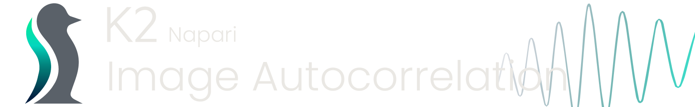
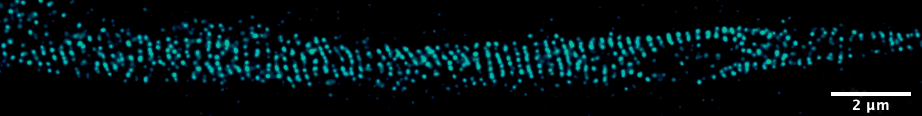

# napari-k2-autocorrelation

    

<h2>About this plugin</h2>

This Napari plugin was designed for the detection and quantification of periodic biological structures.
As this plugin has not been uploaded to napari-hub as of this moment it **cannot be installed on a pre-compiled, bundled 
version of Napari**. Therefor Napari will need to be installed as a python package 
(<a href="https://napari.org/stable/tutorials/fundamentals/installation.html">more info about Napari installation</a>). 
Further information about the installation and licensing of the plugin can be found below. 

<h3>Background</h3>

Actin is the most abundant protein in eukaryotic cells. As it is part of the cytoskelleton its function essential for 
the maintenance of cell's morfological structure. In neurons, it was only recently that researchers started paying 
attention to the peculiar subcelular orgazation and localization of actin. First focussed on the dentritic spines, 
later expanding to the axon.  

The axon initial segment (AIS) is defines as the most proximal 30-60 µm of the axon and is known for its sturdy actin-betaIV cytoskeletal structure which is known to facilitate the densely packed ion channels, regulatory and scaffolding proteins on the membrane. 

    

    

    
    
Example image of Kv1.1 made on a Zeiss AxioImager Z1 equiped with a STEDYCON scanhead detector for confocal and super-resolution imaging, fitted with 4 APDs. 

----------------------------------

This [napari] plugin was generated with [Cookiecutter] using [@napari]'s [cookiecutter-napari-plugin] template.

<!--
Don't miss the full getting started guide to set up your new package:
https://github.com/napari/cookiecutter-napari-plugin#getting-started

and review the napari docs for plugin developers:
https://napari.org/plugins/index.html
-->

## Installation

You can install `napari-k2-autocorrelation` via [pip]:

    pip install napari-k2-autocorrelation

## Contributing

Contributions are very welcome. Tests can be run with [tox], please ensure
the coverage at least stays the same before you submit a pull request.

## License

Distributed under the terms of the [BSD-3] license,
"napari-k2-autocorrelation" is free and open source software

## Issues

If you encounter any problems, please [file an issue] along with a detailed description.

[napari]: https://github.com/napari/napari

[Cookiecutter]: https://github.com/audreyr/cookiecutter

[@napari]: https://github.com/napari

[MIT]: http://opensource.org/licenses/MIT

[BSD-3]: http://opensource.org/licenses/BSD-3-Clause

[GNU GPL v3.0]: http://www.gnu.org/licenses/gpl-3.0.txt

[GNU LGPL v3.0]: http://www.gnu.org/licenses/lgpl-3.0.txt

[Apache Software License 2.0]: http://www.apache.org/licenses/LICENSE-2.0

[Mozilla Public License 2.0]: https://www.mozilla.org/media/MPL/2.0/index.txt

[cookiecutter-napari-plugin]: https://github.com/napari/cookiecutter-napari-plugin

[napari]: https://github.com/napari/napari

[tox]: https://tox.readthedocs.io/en/latest/

[pip]: https://pypi.org/project/pip/

[PyPI]: https://pypi.org/
